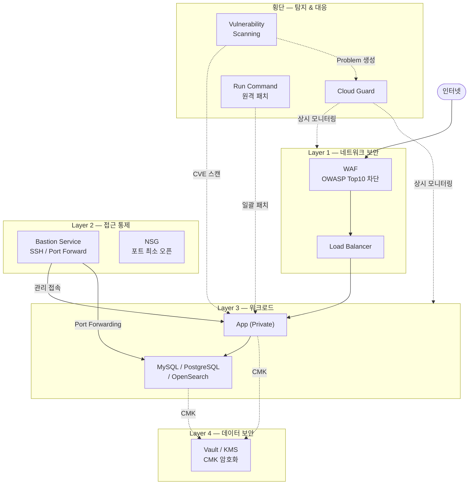

# OCI 보안 리소스 설정 빠른 참조

> 고객 질문: "보안 리소스 설정하는 방법을 간단하게 알려주세요"

## 💡 고객에게 먼저 드리는 한 마디

> "OCI 보안은 레이어입니다. 방화벽 하나, 스캐너 하나로는 절반만 막힙니다. 여섯 가지 서비스가 연결될 때 비로소 방어선이 완성됩니다."

---

## OCI Native 보안 서비스 지원 범위 요약

| 보안 영역 | 서비스 | 지원 | 핵심 제약 |
|----------|--------|------|----------|
| L7 공격 차단 | WAF | ○ | Bot 관리·실시간 위협 인텔은 △/× |
| DB 접근통제 | NSG + Bastion | ○ | SQL 파싱·실시간 차단은 × (DAM 필요) |
| 암호화 키 관리 | Vault / KMS | ○ | 자동 키 회전은 △ (수동 트리거) |
| CVE 취약점 점검 | Vulnerability Scanning | ○ | 실시간 행위 탐지는 × (EDR 필요) |
| 보안 위협 탐지 | Cloud Guard | ○ | 런타임 분석·UEBA는 △/× (SIEM 필요) |
| 원격 명령 실행 | Run Command | ○ | 실시간 인터랙티브 세션은 × |

> ○ Native로 충분  △ 제약 있음  × Native 불가 (전문 솔루션 필요)

## 전체 방어 아키텍처 (Defense in Depth)



## 서비스 연동이 없을 때 발생하는 보안 사각지대

| 누락 설정 | 사각지대 |
|---------|---------|
| Cloud Guard 미활성화 | 설정 오류 탐지 안 됨 |
| Vulnerability Scanning 미연동 | CVE 발견해도 Cloud Guard Problem 미생성 |
| OS Management Agent 미설치 | 패치 미적용 인스턴스 탐지 안 됨 |
| WAF 없이 LB 공인 노출 | L7 공격 무방비 |
| Vault 미사용 | DB 비밀번호 코드/환경변수에 평문 노출 |

---

## OCI 주요 보안 서비스 한눈에 보기

| 보안 영역 | OCI 서비스 | 콘솔 경로 |
|----------|-----------|----------|
| 네트워크 보안 (L7) | WAF | `Identity & Security > Web Application Firewall` |
| 접근 제어 | Bastion Service | `Identity & Security > Bastion` |
| 비밀/키 관리 | Vault (KMS) | `Identity & Security > Vault` |
| 위협 탐지 | Cloud Guard | `Identity & Security > Cloud Guard` |
| 취약점 점검 | Vulnerability Scanning | `Identity & Security > Vulnerability Scanning` |
| 원격 명령 실행 | Run Command | `Compute > Instances > [인스턴스] > Run Command` |

---

## 보안 설정 최소 체크리스트

### 1. 네트워크 계층
- [ ] VCN Security List / NSG 에서 불필요한 인바운드 포트 차단
- [ ] 인터넷 노출 로드밸런서에 WAF Policy 연결
- [ ] Bastion Session 으로만 SSH/RDP 접근 허용 (공인 IP 직접 오픈 금지)

### 2. 데이터 보안
- [ ] OCI Vault 마스터 암호화 키(MEK) 생성
- [ ] Block Volume / Object Storage 에 고객 관리 키(CMK) 적용
- [ ] DB 시스템 암호화 확인 (MySQL HeatWave: 기본 활성화)

### 3. 탐지 & 대응
- [ ] Cloud Guard 활성화 (타깃: Root Compartment)
- [ ] Vulnerability Scanning Service 활성화 및 스캔 스케줄 설정
- [ ] OS Management Agent 설치 확인

### 4. 접근 관리
- [ ] IAM Policy 최소 권한 원칙 적용
- [ ] MFA 강제 활성화 (Identity > Users)

---

## OCI CLI 환경 빠른 확인

```bash
# OCI CLI 버전 확인
oci --version

# 현재 프로필 및 테넌시 확인
oci iam tenancy get --tenancy-id $(oci iam user get --user-id $(oci iam user list --query 'data[0].id' --raw-output) --query 'data."compartment-id"' --raw-output) 2>/dev/null

# 현재 사용자 확인
oci iam user get --user-id $(oci iam user list --query 'data[0].id' --raw-output)

# Compartment 목록 조회
oci iam compartment list --compartment-id-in-subtree true --query 'data[*].{Name:name, OCID:id}' --output table
```

---

## 관련 문서

- [WAF 설정](01_waf.md)
- [DB 접근통제](02_db_access_control.md)
- [암호화 키 관리](03_key_management.md)
- [CVE 취약점 점검](04_cve_scanning.md)
- [Bastion Service](05_bastion.md)
- [Cloud Guard](06_cloud_guard.md)
- [Run Command](07_run_command.md)
