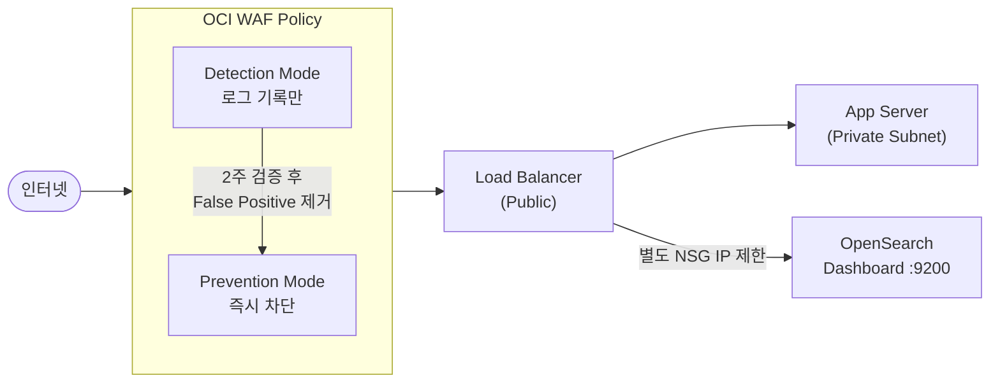

# WAF (Web Application Firewall)

## 개요

OCI WAF는 HTTP/HTTPS 트래픽을 검사하여 SQL Injection, XSS, 봇 트래픽 등 L7 공격을 차단합니다.
로드밸런서(LB) 또는 CDN(Edge) 앞단에 Policy를 연결하는 방식으로 동작합니다.

---

## 💡 고객에게 먼저 드리는 한 마디

> "공격은 막되, 서비스는 살아야 합니다. WAF를 처음부터 Block 모드로 켜면 정상 트래픽까지 막힙니다. Detection 2주, 그 다음 Block — 이것이 서비스 중단 없이 보안을 높이는 유일한 방법입니다."

---

## OCI Native 지원 범위

| 기능 | 지원 | 비고 |
|------|------|------|
| OWASP Top 10 차단 (SQLi, XSS, LFI 등) | ○ | OCI Managed Rule Set 기본 제공 |
| 커스텀 IP / URL / 국가 차단 | ○ | Access Control Rule |
| Rate Limiting (IP당 요청 수 제한) | ○ | DDoS 완화 용도 |
| TLS 취약 버전(1.0/1.1) 차단 | ○ | |
| Bot 관리 (CAPTCHA, JS 챌린지) | △ | Edge 모드에서만 완전 지원 |
| OpenSearch Dashboard 직접 보호 | △ | WAF 연결 후 NSG IP 제한 병행 필요 |
| 실시간 위협 인텔리전스 피드 | × | 전문 WAF/CDN 솔루션 필요 |
| L4 DDoS (대역폭) 방어 | × | OCI DDoS Protection 또는 전문 솔루션 필요 |
| API 스키마 검증 | △ | API Gateway 별도 연동 필요 |

> ○ 가능  △ 제약 있음  × Native 불가 (전문 솔루션 필요)

## 아키텍처



## 운영 리스크 및 주의사항 (요약)

| 리스크 | 상황 | 권고 조치 |
|--------|------|----------|
| **서비스 중단** | Block 전환 직후 정상 API 차단 | Detection 2주 운영 → False Positive URL 화이트리스트 등록 후 전환 |
| **WAF 우회** | LB에 WAF 없이 직접 접근 가능 | LB Security List에서 WAF IP 대역 외 인바운드 차단 |
| **OpenSearch 노출** | Dashboard WAF 미적용 | NSG에서 Dashboard(9200) 접근 IP 명시적 제한 필수 |
| **리전 제약** | Regional WAF는 동일 리전 LB에만 연결 | 멀티 리전 구성 시 리전별 WAF 별도 생성 필요 |

## False Positive 대응 프로세스

```
① Detection 모드로 2주 운영
   └─ WAF 로그 (OCI Logging) 에서 차단 예정 요청 확인
② 정상 트래픽 여부 판단
   └─ 소스 IP, URL 패턴, User-Agent 검토
③ 화이트리스트 등록
   └─ WAF Policy > Access Control > Allow Rule 추가
④ Prevention 모드 전환
   └─ 전환 후 30분간 에러율 모니터링
⑤ OWASP 규칙 세부 조정
   └─ 규칙별 Risk Level 낮추기 (Block → Detect)
```

## 전문 솔루션 도입 검토 시점

| 비즈니스 요구사항 | 검토 카테고리 |
|-----------------|-------------|
| 실시간 위협 인텔리전스 기반 자동 차단 | 전문 클라우드 WAF 서비스 |
| 대용량 L4 DDoS (수백 Gbps) 방어 | Anti-DDoS / CDN 보안 서비스 |
| 글로벌 엣지 PoP에서 WAF + CDN 통합 | CDN 기반 통합 보안 서비스 |
| REST API 스키마 레벨 입력값 검증 | API Security Gateway |

---

## 콘솔 설정

### 1. WAF Policy 생성

1. `Identity & Security > Web Application Firewall > Policies`
2. **Create WAF Policy** 클릭
3. 설정 항목:
   - **Name**: 식별 가능한 이름 (예: `prod-waf-policy`)
   - **Compartment**: 리소스가 위치한 컴파트먼트 선택
4. **Create** 클릭

### 2. Protection Rules 설정

Policy 생성 후 → **Protection Rules** 탭

| 설정 | 권장값 |
|------|--------|
| OWASP Top 10 규칙 세트 | **Detect** 로 시작 후 → 안정화되면 **Block** |
| 요청 크기 제한 | 필요에 따라 설정 (기본 8 KB) |

> **팁**: 처음에는 `Detect` 모드로 운영하며 False Positive를 확인한 후 `Block`으로 전환하세요.

### 3. WAF Policy를 Load Balancer에 연결

1. `Networking > Load Balancers > [LB 선택]`
2. **WAF Policy** 섹션 → **Edit**
3. 생성한 Policy 선택 → **Save Changes**

### 4. 접근 제어 (IP 허용/차단)

1. Policy → **Access Control** 탭
2. **Add Access Rule**:
   - Action: `Allow` 또는 `Block`
   - Condition: 소스 IP, 국가, URL 패턴 등

---

## OCI CLI

```bash
# WAF Policy 목록 조회
oci waf web-app-firewall-policy list \
  --compartment-id <compartment-ocid>

# WAF Policy 생성
oci waf web-app-firewall-policy create \
  --compartment-id <compartment-ocid> \
  --display-name "prod-waf-policy"

# Load Balancer에 WAF Policy 연결 (WebAppFirewall 리소스 생성)
oci waf web-app-firewall create-for-load-balancer \
  --compartment-id <compartment-ocid> \
  --backend-type LOAD_BALANCER \
  --load-balancer-id <lb-ocid> \
  --web-app-firewall-policy-id <policy-ocid> \
  --display-name "prod-waf-lb"

# WAF 연결 상태 확인
oci waf web-app-firewall get \
  --web-app-firewall-id <waf-ocid>

# Protection Rule 목록 확인
oci waf protection-rule list \
  --web-app-firewall-policy-id <policy-ocid>
```

---

## WAF 로그 확인

1. Policy → **Logs** 탭 → **Enable Log** (OCI Logging 서비스 연동)
2. `Observability & Management > Logging > Log Groups`에서 WAF 로그 조회

```bash
# Logging 서비스에서 WAF 로그 조회 (최근 1시간)
oci logging-search search-logs \
  --search-query 'search "<log-group-ocid>/<log-ocid>" | sort by datetime desc' \
  --time-start $(date -u -v-1H +"%Y-%m-%dT%H:%M:%SZ") \
  --time-end $(date -u +"%Y-%m-%dT%H:%M:%SZ")
```

---

## 주의사항

- WAF Policy는 **같은 리전** 내 LB에만 연결 가능합니다.
- Edge (CDN) 모드는 별도 도메인 위임 설정이 필요합니다.
- 기존 LB Security List에서 WAF IP 대역 허용이 필요할 수 있습니다.
