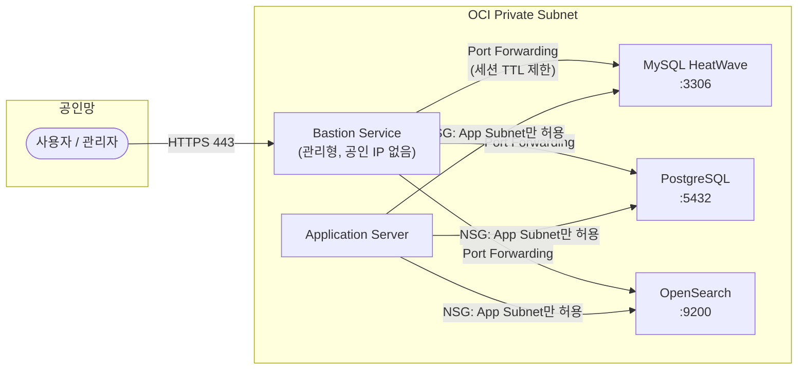

# DB 접근통제 (MySQL / PostgreSQL / OpenSearch)

## 개요

고객 환경: Oracle DB 미사용, **MySQL HeatWave**, **PostgreSQL (OCI Database)**, **OpenSearch** 사용 중.
OCI에서 DB 접근통제는 네트워크 계층(NSG/Security List) + DB 자체 사용자 권한 + Bastion 경유 접속의 3단계 구조로 구성합니다.

---

## 💡 고객에게 먼저 드리는 한 마디

> "DB에 공인 IP는 없어야 합니다. NSG가 자물쇠라면, Bastion이 열쇠입니다. 그리고 SQL 감사 로그 없이는 '누가 무엇을 했는지' 증명할 수 없습니다."

---

## OCI Native 지원 범위

### MySQL HeatWave

| 기능 | 지원 | 비고 |
|------|------|------|
| 네트워크 접근 제어 (NSG/Security List) | ○ | 포트 3306 소스 제한 |
| TLS 암호화 전송 | ○ | require_secure_transport 강제 가능 |
| 저장 암호화 (AES-256) | ○ | 기본 활성화, CMK 적용 가능 |
| DB 사용자 권한 (Schema/Table 단위) | ○ | GRANT/REVOKE |
| 감사 로그 (audit_log) | △ | 활성화 시 성능 영향 주의 |
| SQL 파싱 수준 감사 | × | DAM 솔루션 필요 |
| 실시간 이상 쿼리 차단 | × | DAM 솔루션 필요 |
| DB 세션 녹화 | × | DAM 솔루션 필요 |

### PostgreSQL

| 기능 | 지원 | 비고 |
|------|------|------|
| 네트워크 접근 제어 (NSG) | ○ | 포트 5432 소스 제한 |
| SSL/TLS 강제 | ○ | sslmode=require |
| 저장 암호화 | ○ | CMK 적용 가능 |
| Role 기반 접근 제어 (RBAC) | ○ | Schema/Table 단위 |
| pgAudit 감사 로그 | △ | OCI 관리형에서 제한적 지원 |
| SQL 파싱·실시간 차단 | × | DAM 솔루션 필요 |

### OpenSearch

| 기능 | 지원 | 비고 |
|------|------|------|
| Private Endpoint 전용 (공인 IP 없음) | ○ | 기본 구성 |
| HTTPS (TLS 1.2+) | ○ | 기본 활성화 |
| Fine-Grained Access Control (FGAC) | ○ | 인덱스/필드/도큐먼트 단위 |
| 내부 사용자 인증 | ○ | |
| 감사 로그 | ○ | Dashboard에서 활성화 |
| 실시간 이상 쿼리 차단 | × | |

> ○ 가능  △ 제약 있음  × Native 불가 (전문 솔루션 필요)

## 아키텍처 — No Public IP DB 접근 흐름



## 운영 리스크 및 주의사항 (요약)

| 리스크 | 상황 | 권고 조치 |
|--------|------|----------|
| **감사 로그 성능 영향** | MySQL audit_log / pgAudit 전체 쿼리 로깅 시 성능 저하 | 감사 대상 이벤트 최소화 (로그인 실패, DDL, 관리자 쿼리 위주) |
| **OpenSearch 기본 비밀번호** | 초기 admin 비밀번호 미변경 시 노출 위험 | 클러스터 생성 직후 반드시 변경 |
| **DB 직접 공인 IP 오픈** | 개발 편의를 위해 MySQL 3306 공인 오픈 | 절대 금지 — Bastion Port Forwarding 사용 |
| **앱 서버 자격증명 평문 저장** | 환경변수/config 파일에 DB 비밀번호 기재 | OCI Vault Secret으로 대체 |

## 전문 솔루션 도입 검토 시점

| 비즈니스 요구사항 | 검토 카테고리 |
|-----------------|-------------|
| SQL 파싱 수준 쿼리 감사 및 리포팅 (규제 대응) | DAM (Database Activity Monitoring) |
| 이상 쿼리 실시간 탐지 및 차단 | DAM 또는 DB 방화벽 |
| DB 세션 전체 녹화 (재현 가능한 감사) | DAM 솔루션 |
| 멀티 DB 벤더 통합 감사 (MySQL + PostgreSQL + OpenSearch) | 통합 DAM 플랫폼 |

---

## 1. 네트워크 계층 접근통제 (NSG)

### 콘솔

1. `Networking > Virtual Cloud Networks > [VCN] > Network Security Groups`
2. DB 인스턴스에 연결된 NSG 선택 → **Add Ingress Rules**
3. 허용할 소스: **Bastion Subnet CIDR** 또는 **App Subnet CIDR** 만 지정

| DB | 기본 포트 |
|----|----------|
| MySQL HeatWave | 3306 |
| PostgreSQL | 5432 |
| OpenSearch | 9200 (REST), 9300 (노드간) |

> **원칙**: DB 포트는 인터넷(0.0.0.0/0)에 절대 오픈하지 않습니다. 인터넷 → Bastion → DB 경로만 허용합니다.

### OCI CLI

```bash
# NSG Ingress Rule 추가 (MySQL, Bastion Subnet에서만 허용)
oci network nsg-rules add \
  --nsg-id <nsg-ocid> \
  --ingress-security-rules '[{
    "protocol": "6",
    "source": "<bastion-subnet-cidr>",
    "sourceType": "CIDR_BLOCK",
    "tcpOptions": {
      "destinationPortRange": {"min": 3306, "max": 3306}
    },
    "description": "Allow MySQL from Bastion only"
  }]'

# NSG 규칙 목록 확인
oci network nsg-rules list --nsg-id <nsg-ocid>
```

---

## 2. MySQL HeatWave 접근통제

### 콘솔 — 사용자/권한 관리

1. `Databases > MySQL HeatWave > [DB System] > Connections`에서 엔드포인트 확인
2. Bastion Session을 통해 MySQL 클라이언트로 접속 후 사용자 관리:

```sql
-- 최소 권한 사용자 생성 (특정 DB만 접근)
CREATE USER 'appuser'@'%' IDENTIFIED BY 'StrongPassword123!';
GRANT SELECT, INSERT, UPDATE, DELETE ON appdb.* TO 'appuser'@'%';
FLUSH PRIVILEGES;

-- 관리자 계정 원격 접속 제한 (로컬만 허용)
UPDATE mysql.user SET Host='localhost' WHERE User='admin';
FLUSH PRIVILEGES;

-- 현재 사용자 권한 확인
SHOW GRANTS FOR 'appuser'@'%';
```

### 감사 로그 활성화

1. `Databases > MySQL HeatWave > [DB System] > Logs` → **Enable Audit Log**
2. OCI Logging과 연동하여 로그 중앙화

---

## 3. PostgreSQL 접근통제

### 콘솔 — PostgreSQL Database Service

1. `Databases > PostgreSQL > [DB System]`
2. **Connections** 탭에서 엔드포인트 및 SSL 인증서 확인

```sql
-- 역할 기반 접근 제어
CREATE ROLE readonly;
GRANT CONNECT ON DATABASE appdb TO readonly;
GRANT USAGE ON SCHEMA public TO readonly;
GRANT SELECT ON ALL TABLES IN SCHEMA public TO readonly;

CREATE USER reportuser WITH PASSWORD 'StrongPassword123!' IN ROLE readonly;

-- pg_hba.conf 방식 대신 OCI NSG로 네트워크 통제
-- DB 자체는 특정 스키마/테이블 단위 권한으로 제어

-- 현재 접속 세션 확인
SELECT pid, usename, application_name, client_addr, state
FROM pg_stat_activity
WHERE state = 'active';
```

### SSL 강제 적용

```sql
-- SSL 연결 여부 확인
SELECT ssl, client_addr FROM pg_stat_ssl JOIN pg_stat_activity USING(pid);

-- 사용자에게 SSL 강제 (pg_hba.conf 또는 아래 명령)
ALTER USER appuser SET ssl=on;
```

---

## 4. OpenSearch 접근통제

### 콘솔 설정

1. `Databases > OpenSearch > [Cluster]`
2. **Security** 탭 → Fine-Grained Access Control 설정

```bash
# OpenSearch 클러스터 상태 확인 (Bastion 터널 경유)
curl -XGET "https://<opensearch-endpoint>:9200/_cluster/health" \
  -u admin:password --insecure

# 인덱스별 접근 권한 정책 생성
curl -XPUT "https://<opensearch-endpoint>:9200/_plugins/_security/api/roles/readonly_role" \
  -H 'Content-Type: application/json' \
  -u admin:password --insecure \
  -d '{
    "cluster_permissions": ["cluster_composite_ops_ro"],
    "index_permissions": [{
      "index_patterns": ["logs-*"],
      "allowed_actions": ["read"]
    }]
  }'

# 사용자에게 역할 매핑
curl -XPUT "https://<opensearch-endpoint>:9200/_plugins/_security/api/rolesmapping/readonly_role" \
  -H 'Content-Type: application/json' \
  -u admin:password --insecure \
  -d '{"users": ["reportuser"]}'
```

---

## 접근 흐름 요약

```
사용자 PC
  │
  ▼ (SSH 터널 또는 Port Forwarding)
OCI Bastion Service
  │
  ▼ (NSG: Bastion Subnet → DB Subnet 포트만 허용)
MySQL:3306 / PostgreSQL:5432 / OpenSearch:9200
  │
  ▼ (DB 사용자 권한: 최소 권한 원칙)
특정 DB / 스키마 / 인덱스만 접근 가능
```

→ Bastion Service 설정 상세: [05_bastion.md](05_bastion.md)
