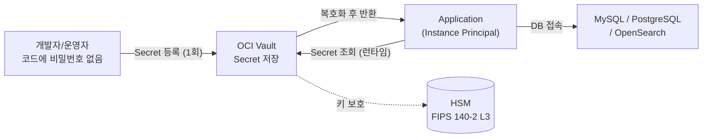

# 암호화 키 관리 (OCI Vault / KMS)

## 개요

OCI Vault는 암호화 키(Master Encryption Key, MEK)와 시크릿(Secret)을 중앙 관리합니다.
Block Volume, Object Storage, DB 시스템 등에 고객 관리 키(Customer-Managed Key, CMK)를 적용하여 OCI 기본 관리 키 대신 직접 키 생명주기를 제어할 수 있습니다.

---

## 💡 고객에게 먼저 드리는 한 마디

> "키를 잃으면 데이터를 잃습니다. OCI Vault는 암호화 키를 HSM 안에 가두고, 코드에서 DB 비밀번호를 없애줍니다. 키 관리는 보안의 마지막 보루입니다."

---

## OCI Native 지원 범위

| 기능 | 지원 | 비고 |
|------|------|------|
| AES-128/192/256 대칭키 관리 | ○ | Block Volume, Object Storage 암호화 |
| RSA / ECDSA 비대칭키 관리 | ○ | 서명, TLS 인증서 래핑 |
| HSM 보호 (FIPS 140-2 Level 3) | ○ | Virtual Private Vault |
| BYOK (고객 키 가져오기) | ○ | RSA 래핑 방식 |
| DB 비밀번호 Secret 관리 | ○ | MySQL, PostgreSQL 자격증명 저장 |
| Block/Boot Volume CMK 적용 | ○ | |
| Object Storage CMK 적용 | ○ | |
| MySQL HeatWave CMK 적용 | ○ | |
| 자동 키 회전 스케줄 | △ | 수동 트리거만 지원 (자동화 스크립트 필요) |
| 외부 HSM 직접 연동 | × | 외부 KMS 솔루션 연동 불가 |
| 멀티 클라우드 키 동기화 | × | OCI 전용 |

> ○ 가능  △ 제약 있음  × Native 불가 (전문 솔루션 필요)

## 아키텍처 — Secret 기반 DB 접속



## 운영 리스크 및 주의사항 (요약)

| 리스크 | 상황 | 권고 조치 |
|--------|------|----------|
| **복호화 불가** | CMK 키 삭제 후 암호화된 데이터 접근 불가 | 키 삭제 전 의존 리소스 전수 확인 필수 |
| **Vault 삭제 유예** | Vault 삭제 요청 후 7~30일 유예 기간 | 즉각 삭제 불가 — 삭제 일정 계획 필요 |
| **자동 키 회전 부재** | 수동 트리거만 지원 | OCI Events + Functions로 주기적 자동화 가능 |
| **IAM 과다 권한** | 키 관리 권한을 운영자 전체에 부여 시 키 삭제 위험 | `key-admins` 그룹 별도 운영, 최소 권한 |

## 전문 솔루션 도입 검토 시점

| 비즈니스 요구사항 | 검토 카테고리 |
|-----------------|-------------|
| 멀티 클라우드 키 중앙 관리 필요 | 외부 KMS / Secrets Manager 솔루션 |
| 하드웨어 HSM 직접 소유 필요 (규제) | On-Premises HSM + BYOK |
| 키 회전 자동화 + 감사 리포트 자동화 | 전문 Key Lifecycle Management 솔루션 |

---

## 1. Vault 및 Master Key 생성

### 콘솔

1. `Identity & Security > Vault`
2. **Create Vault** 클릭
   - **Name**: `prod-vault`
   - **Vault Type**: `Virtual Private Vault` (전용 HSM) 또는 `Default Shared` 선택
     > Virtual Private Vault는 비용이 높지만 키가 전용 HSM 파티션에 격리됩니다.
3. Vault 생성 후 → **Master Encryption Keys** 탭 → **Create Key**
   - **Protection Mode**: `HSM` (권장) 또는 `Software`
   - **Algorithm**: `AES` (대칭키, 블록 암호화용) / `RSA` 또는 `ECDSA` (비대칭키, 서명용)
   - **Key Shape / Length**: AES-256 권장

### OCI CLI

```bash
# Vault 생성
oci kms management vault create \
  --compartment-id <compartment-ocid> \
  --display-name "prod-vault" \
  --vault-type DEFAULT

# Vault 목록 조회
oci kms management vault list \
  --compartment-id <compartment-ocid> \
  --output table

# Vault의 Management Endpoint 확인 (키 생성 시 필요)
oci kms management vault get \
  --vault-id <vault-ocid> \
  --query 'data."management-endpoint"' \
  --raw-output

# AES-256 마스터 키 생성
oci kms management key create \
  --compartment-id <compartment-ocid> \
  --display-name "prod-master-key-aes256" \
  --key-shape '{"algorithm":"AES","length":32}' \
  --protection-mode HSM \
  --endpoint <management-endpoint>

# 키 목록 조회
oci kms management key list \
  --compartment-id <compartment-ocid> \
  --endpoint <management-endpoint> \
  --output table
```

---

## 2. Block Volume에 CMK 적용

### 콘솔

1. `Storage > Block Volumes > [볼륨 선택]`
2. **Edit** → **Encryption** 섹션
3. **Encrypt using customer-managed keys** 선택
4. Vault 및 Key 선택 → **Save Changes**

### OCI CLI

```bash
# Block Volume 생성 시 CMK 적용
oci bv volume create \
  --availability-domain <ad-name> \
  --compartment-id <compartment-ocid> \
  --display-name "encrypted-volume" \
  --size-in-gbs 100 \
  --kms-key-id <key-ocid>

# 기존 볼륨에 CMK 적용 (재암호화)
oci bv volume update \
  --volume-id <volume-ocid> \
  --kms-key-id <key-ocid>
```

---

## 3. Object Storage에 CMK 적용

### 콘솔

1. `Storage > Object Storage > [Bucket 선택]`
2. **Edit Bucket** → **Encryption** → **Customer-Managed Keys** 선택
3. Vault / Key 선택 → **Save**

### OCI CLI

```bash
# 버킷에 CMK 적용
oci os bucket update \
  --namespace <namespace> \
  --bucket-name <bucket-name> \
  --kms-key-id <key-ocid>

# 버킷 암호화 설정 확인
oci os bucket get \
  --namespace <namespace> \
  --bucket-name <bucket-name> \
  --query 'data."kms-key-id"'
```

---

## 4. 시크릿(Secret) 관리

DB 비밀번호, API 키 등을 Vault Secret으로 저장하면 코드에 평문 자격증명을 포함하지 않아도 됩니다.

### 콘솔

1. Vault → **Secrets** 탭 → **Create Secret**
2. **Secret Content**: 저장할 값 입력 (예: DB 비밀번호)
3. 애플리케이션에서 Instance Principal 또는 Resource Principal로 시크릿 조회

### OCI CLI

```bash
# 시크릿 생성 (Base64 인코딩 필요)
SECRET_VALUE=$(echo -n "MyDBPassword123!" | base64)

oci vault secret create-base64 \
  --compartment-id <compartment-ocid> \
  --vault-id <vault-ocid> \
  --key-id <key-ocid> \
  --secret-name "prod-db-password" \
  --secret-content-content "$SECRET_VALUE"

# 시크릿 값 조회
oci secrets secretbundle get \
  --secret-id <secret-ocid> \
  --query 'data."secret-bundle-content".content' \
  --raw-output | base64 --decode

# 시크릿 목록 조회
oci vault secret list \
  --compartment-id <compartment-ocid> \
  --vault-id <vault-ocid> \
  --output table
```

---

## 5. 키 회전 (Key Rotation)

### 콘솔

1. Vault → **Master Encryption Keys** → 키 선택
2. **Rotate Key** 클릭 → 새 버전 생성 확인

```bash
# 키 버전 생성 (= 키 회전)
oci kms management key-version create \
  --key-id <key-ocid> \
  --endpoint <management-endpoint>

# 키 버전 목록 확인
oci kms management key-version list \
  --key-id <key-ocid> \
  --endpoint <management-endpoint>
```

> 키 회전 후 기존 데이터는 이전 키 버전으로 복호화 가능하며, 신규 암호화는 새 버전을 사용합니다.

---

## 주의사항

- 키 삭제 전 반드시 해당 키로 암호화된 리소스가 없는지 확인하세요.
- Vault 삭제 시 최소 7일 ~ 최대 30일의 유예기간이 있습니다.
- IAM Policy로 특정 그룹만 키 관리 권한을 부여하세요:
  ```
  Allow group key-admins to manage keys in compartment prod-compartment
  Allow group key-admins to manage vaults in compartment prod-compartment
  ```
