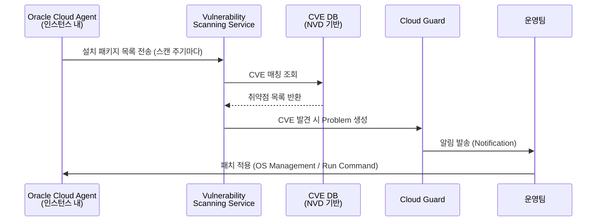

# CVE 취약점 점검 (Vulnerability Scanning Service)

## 개요

OCI Vulnerability Scanning Service(VSS)는 Compute 인스턴스의 OS 패키지 취약점(CVE)을 자동으로 점검합니다.
OS Management Agent(또는 Oracle Cloud Agent의 Vulnerability Scanning 플러그인)를 통해 에이전트리스가 아닌 에이전트 기반으로 동작합니다.

---

## 💡 고객에게 먼저 드리는 한 마디

> "모르는 취약점은 막을 수 없습니다. CVE 스캔은 '이미 뚫릴 수 있는 구멍'을 찾는 작업입니다. 주 1회 스캔 + 패치가 가장 현실적인 OS 보안의 시작입니다."

---

## OCI Native 지원 범위

| 기능 | 지원 | 비고 |
|------|------|------|
| OS 패키지 CVE 점검 (NVD 기반) | ○ | Oracle Linux, Ubuntu, CentOS, Windows Server |
| CIS 벤치마크 점검 | ○ | Strict 레벨에서 지원 |
| 컨테이너 이미지 취약점 스캔 (OCIR) | ○ | OCI Container Registry 이미지 |
| 포트 스캔 | ○ | 오픈 포트 탐지 |
| CVSS 기반 심각도 분류 | ○ | Critical / High / Medium / Low |
| Cloud Guard 자동 연동 | ○ | CVE 발견 시 Problem 자동 생성 |
| OS 패치 일괄 적용 (콘솔) | ○ | OS Management Service 연동 |
| 실시간 프로세스/파일 행위 탐지 | × | EDR/XDR 솔루션 필요 |
| 메모리 포렌식 / 루트킷 탐지 | × | 전문 포렌식 솔루션 필요 |
| 네트워크 트래픽 행위 분석 | × | NDR 솔루션 필요 |

> ○ 가능  △ 제약 있음  × Native 불가 (전문 솔루션 필요)

## 아키텍처 — CVE 스캔 → Cloud Guard 연동 흐름



## 운영 리스크 및 주의사항 (요약)

| 리스크 | 상황 | 권고 조치 |
|--------|------|----------|
| **결과 폭증** | Strict(CIS 벤치마크) 첫 스캔 시 수백~수천 건 | Standard 레벨로 시작 → 안정화 후 Strict 적용 |
| **에이전트 미실행** | Oracle Cloud Agent 중단 시 스캔 불가 | Cloud Guard에서 "Agent not running" Problem 탐지 |
| **패치 후 재스캔** | 패치 적용 후 스캔 결과가 즉시 갱신되지 않음 | 수동 재스캔 또는 다음 스캔 주기 대기 |
| **컨테이너 런타임** | 이미지 스캔과 실제 실행 중 컨테이너는 별개 | 런타임 행위 탐지는 EDR 별도 필요 |

## 전문 솔루션 도입 검토 시점

| 비즈니스 요구사항 | 검토 카테고리 |
|-----------------|-------------|
| 실시간 프로세스 이상 행위 탐지 필요 | EDR (Endpoint Detection & Response) |
| 실행 중 컨테이너 런타임 보안 | CWPP (Cloud Workload Protection Platform) |
| 메모리/네트워크 기반 고급 위협 탐지 | XDR (Extended Detection & Response) |
| 취약점 → 패치 자동화 파이프라인 | 취약점 관리 플랫폼 |

---

## 1. Oracle Cloud Agent 플러그인 확인 및 활성화

### 콘솔

1. `Compute > Instances > [인스턴스 선택]`
2. **Oracle Cloud Agent** 탭
3. **Vulnerability Scanning** 플러그인 → **Enabled** 확인
   - Disabled 상태라면 토글을 **Enable**로 변경

### OCI CLI

```bash
# 인스턴스의 Cloud Agent 플러그인 상태 확인
oci compute instance get \
  --instance-id <instance-ocid> \
  --query 'data."agent-config"."plugins-config"'

# Vulnerability Scanning 플러그인 활성화
oci compute instance update \
  --instance-id <instance-ocid> \
  --agent-config '{
    "plugins-config": [
      {
        "name": "Vulnerability Scanning",
        "desired-state": "ENABLED"
      }
    ]
  }'
```

---

## 2. Scan Recipe 생성

스캔 주기와 점검 항목(OS 패키지, CIS 벤치마크 등)을 정의합니다.

### 콘솔

1. `Identity & Security > Vulnerability Scanning > Scan Recipes`
2. **Create Scan Recipe** 클릭
3. 설정:

| 항목 | 권장값 |
|------|--------|
| **Recipe Type** | `Host` (Compute 인스턴스용) |
| **Scan Level** | `Standard` (CVE 점검) 또는 `Strict` (CIS 벤치마크 포함) |
| **Schedule** | `Weekly` (최초 설정) → 안정화 후 `Daily` |
| **Agent-based** | 체크 (Oracle Cloud Agent 사용) |

### OCI CLI

```bash
# Host Scan Recipe 생성 (Weekly, Standard)
oci vulnerability-scanning host-scan-recipe create \
  --compartment-id <compartment-ocid> \
  --display-name "prod-weekly-scan" \
  --schedule '{"type":"WEEKLY","dayOfWeek":"SUNDAY"}' \
  --port-settings '{"scanLevel":"STANDARD"}' \
  --agent-settings '{"scanLevel":"STANDARD","agentConfigurationDefined":true}'

# Recipe 목록 조회
oci vulnerability-scanning host-scan-recipe list \
  --compartment-id <compartment-ocid> \
  --output table
```

---

## 3. Scan Target 생성

어떤 인스턴스(또는 컴파트먼트 전체)를 스캔할지 지정합니다.

### 콘솔

1. `Identity & Security > Vulnerability Scanning > Scan Targets`
2. **Create Scan Target**
3. 설정:
   - **Target Type**: `Instance` (개별) 또는 `Compartment` (전체)
   - **Scan Recipe**: 위에서 생성한 Recipe 선택

### OCI CLI

```bash
# Compartment 전체를 대상으로 Scan Target 생성
oci vulnerability-scanning host-scan-target create \
  --compartment-id <compartment-ocid> \
  --display-name "prod-all-instances" \
  --host-scan-recipe-id <recipe-ocid> \
  --target-compartment-id <compartment-ocid>

# 특정 인스턴스만 타깃 지정
oci vulnerability-scanning host-scan-target create \
  --compartment-id <compartment-ocid> \
  --display-name "prod-specific-instances" \
  --host-scan-recipe-id <recipe-ocid> \
  --instance-ids '["<instance-ocid-1>","<instance-ocid-2>"]'
```

---

## 4. 스캔 결과 확인

### 콘솔

1. `Identity & Security > Vulnerability Scanning > Scan Results`
2. 인스턴스별 **Risk Score** 및 CVE 목록 확인
3. CVE 항목 클릭 → **CVSS Score**, 영향받는 패키지, 수정 방법 확인

### OCI CLI

```bash
# 스캔 결과 목록 (최근 스캔)
oci vulnerability-scanning host-scan-result list \
  --compartment-id <compartment-ocid> \
  --output table

# 특정 인스턴스의 취약점 목록
oci vulnerability-scanning vulnerability list \
  --compartment-id <compartment-ocid> \
  --instance-id <instance-ocid> \
  --output table

# 심각도 HIGH 이상 필터
oci vulnerability-scanning vulnerability list \
  --compartment-id <compartment-ocid> \
  --severity HIGH \
  --output table
```

---

## 5. 취약점 수정 (패치)

스캔에서 발견된 취약 패키지는 OS 패키지 관리자로 업데이트합니다.

```bash
# Oracle Linux / CentOS
sudo yum update --security -y

# Ubuntu / Debian
sudo apt update && sudo apt upgrade -y

# 특정 패키지만 업데이트
sudo yum update <package-name> -y
```

> OCI OS Management Service를 사용하면 콘솔에서 일괄 패치 적용이 가능합니다.
> `Observability & Management > OS Management`

---

## 6. Cloud Guard 연동

Vulnerability Scanning 결과는 Cloud Guard에서 Problem으로 나타납니다.

> 상세 내용 → [06_cloud_guard.md](06_cloud_guard.md)

---

## 주의사항

- Oracle Cloud Agent가 **Running** 상태여야 스캔이 동작합니다.
- 에이전트 상태 확인: 인스턴스 내부에서 `systemctl status oracle-cloud-agent`
- CIS 벤치마크 스캔(`Strict` 레벨)은 스캔 시간이 길고 결과가 많으므로 처음에는 `Standard`로 시작 권장
