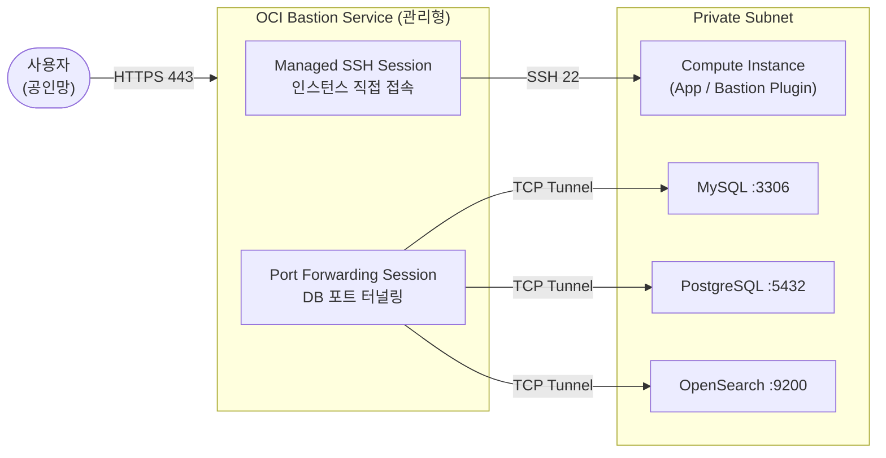

# OCI Bastion Service (SSL VPN 대체 접속)

> 고객 질문: "타 테넌시에서는 SSL VPN을 사용하여 Bastion Service를 통해 서버에 접속하는데, 해당 프로젝트에는 SSL VPN이 없는데 OCI Bastion Service만 사용해도 보안상 문제가 없을까요?"

## 💡 고객에게 먼저 드리는 한 마디

> "SSL VPN 없어도 됩니다. Bastion은 VPN보다 더 좁고, 더 강합니다. VPN은 내부망 전체를 열지만, Bastion은 딱 하나의 인스턴스, 딱 하나의 포트, 그것도 시간 제한 안에서만 열립니다."

---

## OCI Native 지원 범위

| 기능 | 지원 | 비고 |
|------|------|------|
| SSH (Managed SSH Session) | ○ | Oracle Cloud Agent 필요 |
| Port Forwarding (DB 접속) | ○ | MySQL:3306 / PostgreSQL:5432 / OpenSearch:9200 |
| 세션 TTL 자동 만료 | ○ | 최대 3시간, 만료 시 자동 종료 |
| IAM 기반 접근 제어 | ○ | 사용자·그룹별 인스턴스 접근 정책 |
| 소스 IP 제한 (CIDR Allowlist) | ○ | 사무실 IP만 허용 가능 |
| OCI Audit 세션 기록 | ○ | 변조 불가 감사 로그 |
| MFA 강제 연동 | ○ | OCI IAM MFA 정책 적용 |
| RDP (Windows 원격 데스크탑) | ○ | Port Forwarding 방식 |
| 상시 켜진 VPN 터널 | × | 세션 단위 접속만 지원 |
| 전체 내부망 라우팅 | × | 특정 인스턴스/포트만 허용 |
| 화면 녹화 / 세션 재현 | × | PAM 솔루션 필요 |

> ○ 가능  △ 제약 있음  × Native 불가 (전문 솔루션 필요)

## 아키텍처



---

## 결론 먼저

**OCI Bastion Service만으로도 보안상 충분합니다.**

OCI Bastion은 다음을 제공합니다:
- 인스턴스에 공인 IP 없이 SSH/RDP 접속
- 세션 단위 시간 제한 (최대 3시간, 기본 1800초)
- IAM 기반 접근 제어 (누가 어떤 인스턴스에 접속할 수 있는지 정책으로 통제)
- OCI Audit Log에 모든 세션 생성/삭제 기록

SSL VPN의 역할(터널 암호화, 접근 통제)을 Bastion + SSH 암호화 + IAM Policy로 대체할 수 있습니다.

---

## 1. Bastion 생성

### 콘솔

1. `Identity & Security > Bastion`
2. **Create Bastion** 클릭
3. 설정:
   - **Bastion Name**: `prod-bastion`
   - **Target VCN**: 접속 대상 인스턴스가 있는 VCN 선택
   - **Target Subnet**: Bastion이 위치할 서브넷 (대상 인스턴스와 같은 VCN 내)
   - **CIDR Block Allowlist**: 접속 허용 소스 IP 범위 (예: 사무실 공인 IP `/32`)
     > `0.0.0.0/0`은 보안상 권장하지 않음. 가능한 한 좁게 설정하세요.
4. **Create Bastion** 클릭

### OCI CLI

```bash
# Bastion 생성
oci bastion bastion create \
  --compartment-id <compartment-ocid> \
  --bastion-type STANDARD \
  --name "prod-bastion" \
  --target-subnet-id <subnet-ocid> \
  --client-cidr-list '["<your-office-ip>/32"]'

# Bastion 목록 확인
oci bastion bastion list \
  --compartment-id <compartment-ocid> \
  --output table
```

---

## 2. Managed SSH Session 생성 (인스턴스 직접 접속)

Oracle Cloud Agent의 Bastion 플러그인이 활성화된 인스턴스에 사용합니다.

### 콘솔

1. Bastion → **Create Session**
2. **Session Type**: `Managed SSH Session`
3. 설정:
   - **SSH Key**: 본인의 공개키 붙여넣기
   - **Target Instance**: 접속할 인스턴스 선택
   - **Session TTL**: 기본 1800초 (30분), 최대 10800초 (3시간)
4. **Create Session** → 생성 후 SSH 명령 복사

### OCI CLI

```bash
# Managed SSH Session 생성
oci bastion session create-managed-ssh \
  --bastion-id <bastion-ocid> \
  --display-name "wylee-session-$(date +%Y%m%d)" \
  --ssh-public-key-file ~/.ssh/id_rsa.pub \
  --target-resource-id <instance-ocid> \
  --target-os-username opc \
  --session-ttl-in-seconds 3600

# 세션 상태 확인 (ACTIVE 될 때까지 대기)
oci bastion session get \
  --session-id <session-ocid> \
  --query 'data."lifecycle-state"'
```

### SSH 접속 명령 (세션 활성화 후)

```bash
# 콘솔의 "SSH Command" 복사 또는 아래 형식으로 접속
ssh -i ~/.ssh/id_rsa \
    -o ProxyCommand='ssh -i ~/.ssh/id_rsa -W %h:%p -p 22 <session-ocid>@host.bastion.<region>.oci.oraclecloud.com' \
    opc@<private-ip-of-instance>
```

---

## 3. Port Forwarding Session (DB 접속용)

MySQL, PostgreSQL, OpenSearch 등 DB에 접속할 때 사용합니다.

### 콘솔

1. Bastion → **Create Session**
2. **Session Type**: `SSH Port Forwarding Session`
3. 설정:
   - **Target Host**: DB 엔드포인트 (Private IP)
   - **Target Port**: 3306 (MySQL) / 5432 (PostgreSQL) / 9200 (OpenSearch)

### OCI CLI

```bash
# MySQL용 Port Forwarding Session 생성
oci bastion session create-port-forwarding \
  --bastion-id <bastion-ocid> \
  --display-name "mysql-port-forward" \
  --ssh-public-key-file ~/.ssh/id_rsa.pub \
  --target-fqdn <mysql-endpoint> \
  --target-port 3306 \
  --session-ttl-in-seconds 3600

# 세션 OCID 확인 후 SSH 터널 생성
ssh -i ~/.ssh/id_rsa \
    -N -L 3306:<mysql-private-ip>:3306 \
    -p 22 <session-ocid>@host.bastion.<region>.oci.oraclecloud.com &

# 로컬에서 MySQL 접속
mysql -h 127.0.0.1 -P 3306 -u admin -p
```

---

## 4. IAM Policy (접근 제어)

```
# Bastion 관리자 (생성/삭제)
Allow group bastion-admins to manage bastion-family in compartment prod-compartment

# 일반 사용자 (세션 생성만)
Allow group developers to use bastion-sessions in compartment prod-compartment
Allow group developers to read bastion-family in compartment prod-compartment
```

---

## 5. 감사 로그 확인

모든 Bastion 세션 생성/접속/삭제는 OCI Audit에 기록됩니다.

```bash
# 최근 Bastion 세션 이벤트 조회
oci audit event list \
  --compartment-id <compartment-ocid> \
  --start-time $(date -u -v-1d +"%Y-%m-%dT%H:%M:%SZ") \
  --end-time $(date -u +"%Y-%m-%dT%H:%M:%SZ") \
  | jq '.data[] | select(.data."event-name" | contains("bastion"))'
```

---

## SSL VPN vs OCI Bastion 보안 비교 (상세)

### 핵심 보안 요소별 비교

| 보안 요소 | SSL VPN | OCI Bastion Service | 비고 |
|----------|---------|---------------------|------|
| **전송 암호화** | TLS 1.2/1.3 터널 | SSH(AES-256) + OCI 내부망 | 동등 수준 |
| **인증 방식** | 인증서 또는 ID/PW | SSH 키페어 + IAM Policy | Bastion이 더 강력 (키 탈취 시 IAM으로 추가 통제) |
| **MFA** | VPN 솔루션에 따라 다름 | OCI IAM MFA 강제 가능 | Bastion 우위 |
| **접근 범위 통제** | VPN 연결 후 내부망 전체 접근 가능 | 세션별 특정 인스턴스/포트만 허용 | **Bastion 우위** (최소 권한) |
| **세션 수명** | VPN 연결 유지 동안 지속 | TTL 설정 (최대 3시간), 만료 시 자동 종료 | **Bastion 우위** (노출 시간 최소화) |
| **감사 로그** | VPN 서버 로그 (별도 보관 필요) | OCI Audit 자동 기록, 변조 불가 | **Bastion 우위** |
| **인프라 관리** | VPN 서버 패치/운영 필요 | 완전 관리형 (취약점 책임 OCI) | **Bastion 우위** |
| **IP 제한** | 클라이언트 IP 제한 설정 복잡 | `client-cidr-list`로 소스 IP 강제 제한 | 동등 수준 |
| **자격증명 탈취 시 피해 범위** | VPN 전체 내부망 노출 | 해당 세션 단일 인스턴스만 노출 | **Bastion 우위** |
| **비용** | VM 운영 비용 (상시) | 세션 시간 기반 (저렴) | Bastion 우위 |

### 보안 사고 시나리오 비교

| 시나리오 | SSL VPN 피해 범위 | OCI Bastion 피해 범위 |
|---------|-----------------|----------------------|
| 자격증명 탈취 | 내부망 **전체** 접근 가능 | 특정 인스턴스 **1개** + TTL 내에서만 |
| 접속 키 유출 | VPN 연결 → 내부망 자유 이동 | IAM Policy로 인스턴스 제한, TTL 만료 시 자동 차단 |
| 무단 접속 시도 | VPN 포트(443/1194) 공인 노출 | OCI 관리형 엔드포인트 (공격 면적 없음) |

---

### Bastion 단독 사용 시 보안 강화 방법

SSL VPN 없이 Bastion만 사용할 때 아래를 추가 적용하면 VPN 이상의 보안 수준을 확보할 수 있습니다.

#### 1. 소스 IP 제한 (필수)
```bash
# 사무실/개인 공인 IP만 Bastion 접근 허용
oci bastion bastion update \

  --bastion-id <bastion-ocid> \
  --client-cidr-list '["<office-ip>/32", "<vpn-exit-ip>/32"]'
```

#### 2. SSH 키 강도 강화
```bash
# ED25519 키 생성 (RSA-2048보다 강력하고 빠름)
ssh-keygen -t ed25519 -C "prod-bastion-$(date +%Y%m)" -f ~/.ssh/prod_bastion_ed25519

# 기존 RSA 키 사용 시 최소 4096비트
ssh-keygen -t rsa -b 4096 -C "prod-bastion" -f ~/.ssh/prod_bastion_rsa
```

#### 3. 세션 TTL 최소화
```bash
# 작업에 필요한 최소 시간만 설정 (기본 1800초 대신 업무별 조정)
oci bastion session create-managed-ssh \

  --bastion-id <bastion-ocid> \
  --ssh-public-key-file ~/.ssh/prod_bastion_ed25519.pub \
  --target-resource-id <instance-ocid> \
  --target-os-username opc \
  --session-ttl-in-seconds 1800   # 30분: 일반 작업
  # --session-ttl-in-seconds 3600  # 1시간: 장시간 작업
```

#### 4. IAM MFA 강제 (OCI 콘솔)
`Identity & Security > Users > [사용자] > Enable Multi-Factor Authentication`

또는 MFA 없는 사용자의 Bastion 세션 생성을 차단하는 IAM Condition 적용:
```
Allow group developers to use bastion-sessions in compartment prod-compartment
  where request.user.mfaTotpVerified = 'true'
```

#### 5. 세션 활성 모니터링 (Cloud Guard 연동)
```bash
# 현재 활성 Bastion 세션 조회
oci bastion session list \

  --bastion-id <bastion-ocid> \
  --session-lifecycle-state ACTIVE \
  --output table

# 비업무 시간대 세션 생성 알림 → OCI Events + Notifications 설정
# Events Rule: eventType = "com.oraclecloud.bastion.createsession"
```
