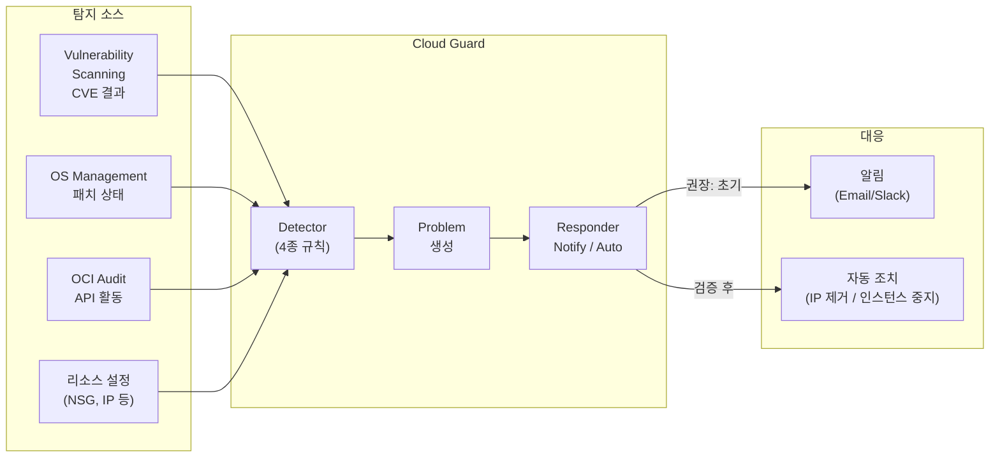

# Cloud Guard (보안 위협 탐지 및 OS 보안)

> 고객 질문: "클라우드 가드에서 확인 가능한 OS 보안쪽은 무엇이 있나요?"

## 개요

OCI Cloud Guard는 테넌시 전체의 보안 상태를 지속적으로 모니터링하여 잘못된 설정(Misconfiguration)과 위협을 탐지합니다.
Detector Recipe(탐지 규칙) → Problem(이슈 생성) → Responder Recipe(자동 대응) 구조로 동작합니다.

---

## 💡 고객에게 먼저 드리는 한 마디

> "설정 오류는 공격자의 문입니다. Cloud Guard는 그 문이 지금 열려 있는지 24시간 알려줍니다. 단, Auto Responder를 바로 켜면 운영 중인 서버가 갑자기 멈출 수 있습니다. Notify 먼저, Auto는 검증 후입니다."

---

## OCI Native 지원 범위

| 기능 | 지원 | 비고 |
|------|------|------|
| 설정 오류 탐지 (Configuration Detector) | ○ | NSG 오픈, 공인 IP 노출 등 |
| CVE 취약점 연동 탐지 (Log Insight) | ○ | Vulnerability Scanning 연동 필요 |
| 위협 행위 탐지 (Threat Detector) | ○ | 비정상 API 패턴, 자격증명 탈취 |
| OS 패치 미적용 탐지 | ○ | OS Management Service 연동 필요 |
| Cloud Guard Problem 자동 알림 | ○ | OCI Notifications → Email/Slack/PagerDuty |
| 자동 대응 (Responder) | △ | 운영 영향 있음 — Notify 모드 우선 권장 |
| 런타임 프로세스 행위 탐지 | △ | 제한적 — 고급 위협은 탐지 어려움 |
| 사용자 행동 분석 (UEBA) | × | SIEM 솔루션 필요 |
| 네트워크 패킷 분석 | × | NDR 솔루션 필요 |
| 외부 SIEM 직접 연동 | △ | OCI Streaming → 외부 SIEM 연동 |

> ○ 가능  △ 제약 있음  × Native 불가 (전문 솔루션 필요)

## 아키텍처 — Cloud Guard 탐지 및 대응 흐름



## 운영 리스크 및 주의사항 (요약)

| 리스크 | 상황 | 권고 조치 |
|--------|------|----------|
| **운영 서버 강제 중지** | Auto Responder `STOP_INSTANCE` 오동작 | 처음에는 반드시 Notify 모드만 활성화 |
| **공인 IP 자동 제거** | Auto Responder `DISABLE_PUBLIC_IP` 적용 시 접근 불가 | 운영 환경에서는 비활성화 또는 화이트리스트 예외 처리 |
| **OS 탐지 미작동** | Vulnerability Scanning / OS Management 미연동 | Cloud Guard 활성화와 함께 두 서비스 동시 활성화 필수 |
| **False Positive 알람 폭증** | 신규 테넌시 초기 수백 건 Problem 발생 | Risk Level HIGH 이상부터 처리, Medium은 단계적 해소 |

## 전문 솔루션 도입 검토 시점

| 비즈니스 요구사항 | 검토 카테고리 |
|-----------------|-------------|
| 사용자 행동 이상 탐지 (UEBA) 필요 | SIEM (Security Information & Event Management) |
| 멀티 클라우드 / On-Premises 통합 보안 모니터링 | SIEM 또는 XDR 플랫폼 |
| 네트워크 트래픽 이상 탐지 | NDR (Network Detection & Response) |
| 규제 대응 보안 운영 센터 (SOC) 구축 | SIEM + SOAR 플랫폼 |

---

## Cloud Guard에서 확인 가능한 OS 보안 항목

Cloud Guard의 OS 보안 탐지는 **4가지 Detector** 유형으로 나뉩니다.

### Detector 유형별 OS 보안 탐지 항목

#### Configuration Detector (설정 오류 탐지)
자동 활성화, 별도 연동 불필요

| Problem 유형 | 탐지 조건 | Risk |
|-------------|----------|------|
| **Instance is publicly accessible** | 공인 IP 할당 + NSG/Security List에 0.0.0.0/0 허용 | High |
| **SSH port publicly exposed** | 포트 22가 0.0.0.0/0 또는 ::/0 에 오픈 | Critical |
| **Instance has open ports** | 불필요한 포트가 인터넷에 노출 | Medium |
| **Boot volume not encrypted** | 부트 볼륨 암호화 미적용 | Medium |
| **Block volume not encrypted** | 블록 볼륨 암호화 미적용 | Medium |

#### Threat Detector (위협 탐지)
OCI Audit 로그 기반 자동 탐지

| Problem 유형 | 탐지 조건 | Risk |
|-------------|----------|------|
| **Anomalous instance activity** | 비정상적인 API 호출 패턴 (인스턴스 대량 생성/삭제 등) | High |
| **Credential theft** | 인스턴스 메타데이터 서비스(IMDS) 비정상 접근 | Critical |
| **Privilege escalation** | IAM 권한 비정상 변경 | Critical |

#### Activity Detector (활동 기반 탐지)
Cloud Guard 규칙으로 사용자/서비스 활동 감시

| Problem 유형 | 탐지 조건 | Risk |
|-------------|----------|------|
| **Unusual user activity** | 평소와 다른 시간대 / 리전에서의 인스턴스 조작 | High |
| **Instance console connection** | 인스턴스 콘솔 직접 접속 (비상 접근) | Medium |

#### Log Insight Detector (로그 패턴 탐지)
**OS Management Service 및 Vulnerability Scanning과 연동 필요**

| Problem 유형 | 탐지 조건 | 필요 서비스 |
|-------------|----------|-----------|
| **Vulnerability found on instance** | CVE CVSS 7.0 이상 패키지 발견 | Vulnerability Scanning |
| **OS patch not up to date** | 보안 패치 미적용 30일 초과 | OS Management Service |
| **Agent not running** | Oracle Cloud Agent 응답 없음 30분 초과 | Oracle Cloud Agent |
| **Root login enabled** | `/etc/ssh/sshd_config`에 `PermitRootLogin yes` 탐지 | OS Management Service |
| **Password authentication enabled** | `PasswordAuthentication yes` 탐지 | OS Management Service |

> **중요**: Log Insight Detector의 OS 항목은 **Vulnerability Scanning Service**와 **OS Management Service**가 활성화되어 있어야 Cloud Guard에 나타납니다.

---

### OS Management Service 활성화 (Cloud Guard 연동 전제)

#### 콘솔
1. `Compute > Instances > [인스턴스] > Oracle Cloud Agent` 탭
2. **OS Management Service Agent** 플러그인 → **Enabled**

#### OCI CLI
```bash
# OS Management Agent 활성화
oci compute instance update \

  --instance-id <instance-ocid> \
  --agent-config '{
    "plugins-config": [
      {"name": "OS Management Service Agent", "desired-state": "ENABLED"},
      {"name": "Vulnerability Scanning",      "desired-state": "ENABLED"}
    ]
  }'

# OS Management 인스턴스 등록 확인
oci os-management managed-instance get \

  --managed-instance-id <instance-ocid>

# 패치 상태 확인
oci os-management managed-instance list-available-updates \

  --managed-instance-id <instance-ocid> \
  --output table
```

---

## 1. Cloud Guard 활성화

### 콘솔

1. `Identity & Security > Cloud Guard`
2. 최초 활성화 시 **Enable Cloud Guard** 클릭
3. **Reporting Region** 선택 (문제 데이터가 저장될 리전)
4. **Target** 설정:
   - **Target Name**: `prod-root-target`
   - **Target Resource Type**: `Compartment`
   - **Target Resource**: Root Compartment (전체 테넌시 커버 권장)
   - **Detector Recipes**: OCI Managed 기본 Recipe 사용

### OCI CLI

```bash
# Cloud Guard 설정 확인
oci cloud-guard configuration get \
  --compartment-id <tenancy-ocid>

# Cloud Guard 활성화
oci cloud-guard configuration update \
  --compartment-id <tenancy-ocid> \
  --status ENABLED \
  --reporting-region <region>

# Target 목록 확인
oci cloud-guard target list \
  --compartment-id <tenancy-ocid> \
  --output table
```

---

## 2. Problem(이슈) 확인

### 콘솔

1. `Identity & Security > Cloud Guard > Problems`
2. 필터 적용:
   - **Risk Level**: `Critical`, `High` 우선 처리
   - **Resource Type**: `Instance` (OS 관련 필터)
   - **Detector**: `Configuration Detector` (설정 문제) / `Threat Detector` (위협)

### OCI CLI

```bash
# 현재 열린 Problem 목록 (HIGH 이상)
oci cloud-guard problem list \
  --compartment-id <compartment-ocid> \
  --compartment-id-in-subtree true \
  --risk-level HIGH \
  --lifecycle-state OPEN \
  --output table

# 인스턴스 관련 Problem만 필터
oci cloud-guard problem list \
  --compartment-id <compartment-ocid> \
  --compartment-id-in-subtree true \
  --resource-type Instance \
  --lifecycle-state OPEN \
  --output table

# 특정 Problem 상세 확인
oci cloud-guard problem get \
  --problem-id <problem-ocid>
```

---

## 3. Detector Recipe 커스터마이징

OCI Managed Recipe는 읽기 전용이므로 Clone 후 수정합니다.

### 콘솔

1. `Cloud Guard > Detector Recipes`
2. **OCI Configuration Detector Recipe** 선택 → **Clone**
3. 클론된 Recipe에서 각 규칙의 **Condition**과 **Risk Level** 수정 가능

```bash
# Detector Recipe 목록
oci cloud-guard detector-recipe list \
  --compartment-id <compartment-ocid> \
  --output table

# Recipe 상세 및 규칙 확인
oci cloud-guard detector-recipe get \
  --detector-recipe-id <recipe-ocid>
```

---

## 4. Responder Recipe (자동 대응)

탐지된 Problem에 대해 자동으로 대응 조치를 취할 수 있습니다.

| Responder 유형 | 동작 |
|---------------|------|
| **DISABLE_PUBLIC_IP** | 공인 IP 제거 |
| **STOP_INSTANCE** | 인스턴스 중지 |
| **ADD_NSG_RULE** | NSG 규칙 추가 (차단) |
| **MAKE_BUCKET_PRIVATE** | Object Storage 버킷 비공개 전환 |

> 자동 대응은 운영 영향이 크므로 처음에는 **알림(Notification)** 모드로만 운영하고 충분히 검토 후 자동화하세요.

### 알림 설정

1. `Cloud Guard > Responder Recipes > [Recipe]`
2. 규칙 편집 → **Mode**: `Notify` 선택
3. OCI Notifications Service 토픽 연결 (이메일/Slack/PagerDuty)

---

## 5. 보안 점수(Security Score) 확인

`Cloud Guard > Overview` 에서 전체 테넌시 보안 점수와 리전별 현황을 확인합니다.

```bash
# 보안 점수 조회
oci cloud-guard security-score-aggregation list \
  --compartment-id <tenancy-ocid>

# Problem 통계 (Risk Level별)
oci cloud-guard problem-aggregation list \
  --compartment-id <tenancy-ocid> \
  --compartment-id-in-subtree true \
  --group-by RISK_LEVEL
```

---

## OS 보안 강화를 위한 연동 서비스

| 서비스 | 역할 | Cloud Guard 연동 |
|--------|------|-----------------|
| Vulnerability Scanning | CVE 점검 | Problem으로 자동 연동 |
| OS Management Service | 패치 관리 | 패치 미적용 인스턴스 탐지 |
| Logging Analytics | 로그 분석 | 이상 행동 탐지 |
| Security Advisor | 보안 권고 | Zone 기반 보안 정책 강제 |

→ CVE 스캔 상세: [04_cve_scanning.md](04_cve_scanning.md)
