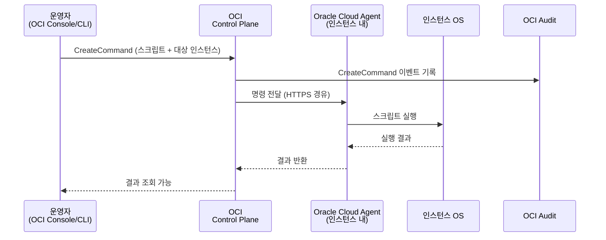

# OCI Run Command (Compute 원격 명령 실행)

## 개요

OCI Run Command(구: Prov2)는 SSH 접속 없이 Compute 인스턴스에 명령을 실행할 수 있는 기능입니다.
Oracle Cloud Agent의 **Run Command 플러그인**을 통해 동작하며, 실행 결과는 Object Storage에 저장되거나 직접 응답으로 반환됩니다.

**주요 사용 사례:**
- SSH 접속 불가 상황에서 응급 명령 실행
- 다수 인스턴스에 일괄 명령 실행 (패치, 설정 변경)
- Bastion 없이 일시적 관리 작업

---

## 💡 고객에게 먼저 드리는 한 마디

> "SSH 없이도 명령을 실행할 수 있습니다. 단, 이 권한이 잘못된 사람에게 있으면 수십 대의 인스턴스가 동시에 위험해집니다. 권한 설계가 기능보다 먼저입니다."

---

## OCI Native 지원 범위

| 기능 | 지원 | 비고 |
|------|------|------|
| SSH 없이 인스턴스 명령 실행 | ○ | Oracle Cloud Agent 필요 |
| Shell Script 실행 (Linux) | ○ | |
| PowerShell 실행 (Windows) | ○ | |
| Object Storage 스크립트 실행 | ○ | 긴 스크립트 권장 방식 |
| 실행 결과 텍스트 반환 | ○ | 소용량 출력 |
| 실행 결과 Object Storage 저장 | ○ | 대용량 출력 |
| 모든 실행 OCI Audit 기록 | ○ | CreateCommand 이벤트 |
| IAM 기반 실행 권한 제어 | ○ | Dynamic Group 연동 |
| 실시간 인터랙티브 터미널 | × | Bastion Managed SSH 사용 |
| 병렬 대량 인스턴스 동시 실행 | △ | 인스턴스별 개별 Command 생성 필요 |
| 실행 결과 스트리밍 | × | 완료 후 결과 조회만 가능 |

> ○ 가능  △ 제약 있음  × Native 불가 (Bastion SSH 또는 자동화 도구 필요)

## 아키텍처 — Run Command 실행 흐름



## 운영 리스크 및 주의사항 (요약)

| 리스크 | 상황 | 권고 조치 |
|--------|------|----------|
| **권한 남용** | `manage instance-agent-command-family` 권한이 광범위 시 전체 인스턴스 무단 명령 가능 | Dynamic Group + 컴파트먼트 단위 최소 권한 설계 필수 |
| **스크립트 무결성** | Object Storage 스크립트가 변조된 경우 악성 명령 실행 | IAM으로 스크립트 버킷 쓰기 권한 엄격히 제한 |
| **루트 권한 실행** | Run Command는 root 또는 opc로 실행됨 | 스크립트 내 sudo 최소화, 필요 권한만 사용 |
| **결과 데이터 노출** | Object Storage 결과 버킷 접근 제한 미설정 | 결과 버킷 IAM Policy 및 CMK 암호화 적용 |

## 전문 솔루션 도입 검토 시점

| 비즈니스 요구사항 | 검토 카테고리 |
|-----------------|-------------|
| 수십~수백 대 인스턴스 일괄 패치 자동화 | 구성 관리 도구 (Ansible, Chef, Puppet 등) |
| 변경 관리 승인 워크플로우 연동 | ITSM + 자동화 플랫폼 |
| 실시간 인터랙티브 감사 세션 | PAM (Privileged Access Management) 솔루션 |

---

## 1. Oracle Cloud Agent 플러그인 활성화

### 콘솔

1. `Compute > Instances > [인스턴스 선택]`
2. **Oracle Cloud Agent** 탭
3. **Run Command** 플러그인 → **Enabled** 확인

### OCI CLI

```bash
# Run Command 플러그인 활성화
oci compute instance update \
  --instance-id <instance-ocid> \
  --agent-config '{
    "plugins-config": [
      {
        "name": "Run Command",
        "desired-state": "ENABLED"
      }
    ]
  }'

# 플러그인 상태 확인
oci compute instance get \
  --instance-id <instance-ocid> \
  --query 'data."agent-config"."plugins-config"'
```

---

## 2. Run Command 실행

### 콘솔

1. `Compute > Instances > [인스턴스 선택]`
2. **Run Command** 탭 (좌측 메뉴)
3. **Create Command** 클릭
4. 설정:
   - **Command Content**: 실행할 쉘 스크립트 입력
   - **Script Type**: `PlainText` 또는 `ObjectStorageBucket` (긴 스크립트)
   - **Output Type**: `Text` (즉시 반환) 또는 `ObjectStorageBucket` (대용량 출력)
   - **Execution Time Limit**: 최대 3600초 (1시간)

### OCI CLI

```bash
# 간단한 명령 실행 (df -h 결과 반환)
oci compute instance-agent command create \
  --compartment-id <compartment-ocid> \
  --instance-id <instance-ocid> \
  --display-name "check-disk-usage" \
  --execution-time-out-in-seconds 300 \
  --content '{
    "source": {
      "sourceType": "TEXT",
      "text": "#!/bin/bash\ndf -h\necho \"Memory:\"\nfree -m"
    },
    "output": {
      "outputType": "TEXT"
    }
  }'

# 명령 실행 상태 확인
oci compute instance-agent command get \
  --command-id <command-id>

# 명령 실행 결과 조회
oci compute instance-agent command-execution get \
  --command-id <command-id> \
  --instance-id <instance-ocid> \
  --query 'data.content'
```

---

## 3. Object Storage 출력 사용 (긴 스크립트/출력)

```bash
# Object Storage에서 스크립트 실행, 결과도 Object Storage에 저장
oci compute instance-agent command create \
  --compartment-id <compartment-ocid> \
  --instance-id <instance-ocid> \
  --display-name "security-audit-script" \
  --execution-time-out-in-seconds 1800 \
  --content '{
    "source": {
      "sourceType": "OBJECT_STORAGE_URI",
      "uri": "https://objectstorage.<region>.oraclecloud.com/n/<namespace>/b/<bucket>/o/audit-script.sh"
    },
    "output": {
      "outputType": "OBJECT_STORAGE_URI",
      "outputUri": "https://objectstorage.<region>.oraclecloud.com/n/<namespace>/b/<bucket>/o/audit-result-$(date +%Y%m%d).txt"
    }
  }'
```

---

## 4. IAM Policy (권한 설정)

Run Command 실행에는 아래 IAM Policy가 필요합니다.

```
# Run Command 실행 권한
Allow group ops-team to manage instance-agent-command-family in compartment prod-compartment

# 인스턴스가 명령을 수신하기 위한 Dynamic Group 설정
# Dynamic Group: all instances in compartment
ALL {resource.type = 'instance', resource.compartment.id = '<compartment-ocid>'}

# Dynamic Group에 대한 Policy
Allow dynamic-group prod-instances to use instance-agent-command-execution-family in compartment prod-compartment
```

---

## 5. 실행 이력 확인

```bash
# 특정 인스턴스의 명령 실행 이력
oci compute instance-agent command-execution list \
  --compartment-id <compartment-ocid> \
  --instance-id <instance-ocid> \
  --output table

# 명령 전체 목록
oci compute instance-agent command list \
  --compartment-id <compartment-ocid> \
  --output table
```

---

## 6. 보안 고려사항

| 항목 | 권고 |
|------|------|
| **실행 권한 최소화** | ops-team 그룹에만 `manage` 권한 부여, 일반 개발자는 제외 |
| **명령 내용 감사** | 모든 실행 명령은 OCI Audit에 기록됨 (`CreateCommand` 이벤트) |
| **스크립트 무결성** | Object Storage의 스크립트에 Object Storage Pre-Auth 또는 PAR 사용 금지, IAM 인증 사용 |
| **출력 데이터 보호** | 결과 버킷에 적절한 IAM Policy 및 암호화 적용 |
| **실행 시간 제한** | `execution-time-out-in-seconds`를 필요 최소한으로 설정 |

---

## SSH vs Run Command 비교

| 항목 | SSH (Bastion 경유) | Run Command |
|------|-------------------|-------------|
| 접속 방식 | 인터랙티브 터미널 | 비인터랙티브 명령 실행 |
| 에이전트 필요 | Bastion Agent | Oracle Cloud Agent |
| 네트워크 | Bastion → 인스턴스 | OCI Control Plane → Agent |
| 감사 로그 | Bastion 세션 로그 | OCI Audit `CreateCommand` |
| 사용 적합 상황 | 실시간 작업, 디버깅 | 일괄 자동화, 응급 명령 |

→ Bastion Service 상세: [05_bastion.md](05_bastion.md)
